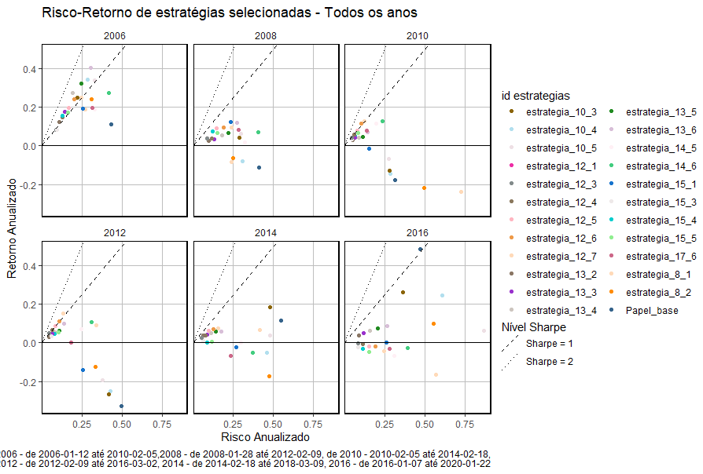
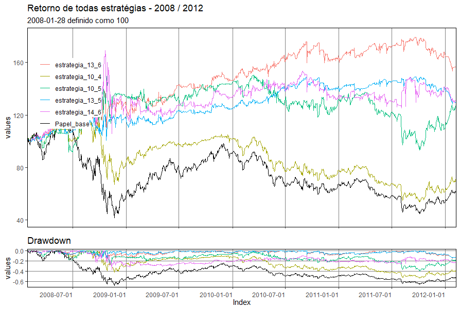

# Backtesting Varios anos

['backtesting_varios_anos.R'](backtesting_varios_anos.R) - Teste para estratégias selecionadas para diferentes periodos. Esse código é bastante semelhante ao ['backtesting.R'](..//backtesting/backtesting.R), diferença mesmo é o loop que itera sobre as janelas para diferentes periodos. Atualmente, como o ['backtesting.R'](..//backtesting/backtesting.R), esse código só testa estratégias para PETR4 ('Papel_base') . Os arquivos utilizados como input são os mesmo do 'backtesting.R'. O exemplo do código utiliza os seguintes periodos :
> "2008-01-28/2012-02-09" , "2010-02-05/2014-02-18" ,"2012-02-09/2016-03-02" , "2014-02-18/2018-03-09" , "2016-01-07/2020-01-22"

Os arquivos gerados por esse código são:

>logs_das_estrategias_varios_anos_{ primeiro_dia_da_janela }.RData ; historico_varios_anos_{ primeiro_dia_da_janela }.RData ; indices_performance_varios_anos_{ primeiro_dia_da_janela }.RData ; retorno_indices_performance_varios_anos_{ primeiro_dia_da_janela }.RData

foram utilizadas 23 estratégias ( as mais interessantes observadas no 'backtesting.R' ). O objeto ('estrategias_melhores') que define essas estratégias está no arquivos ['estrategias.R'](..//backtesting/estrategias.R)

['medidas_de_erro_rolling_window.R'](medidas_de_erro_rolling_window.R) - Código utilizado para definir os cálculos do Value at Risk e do Expected Shortfall. Usei como guia para os cálculos o livro ***Quantitive Risk Management - McNeil, Frey e Embrechts (2005)*** e o código disponível online. Para o cálculo do risco condicional usando a teoria do valor extremo (CONDEVT) minha referência foi o artigo ***Estimation of tail-related risk measures for heteroscedastic financial time series: an extreme value approach -  McNeil e Frey (2000)*** . 

['avaliando_resultados_backtesting_varios_anos.R'](avaliando_resultados_backtesting_varios_anos.R) - Utiliza os dados gerados pelo ['backtesting_varios_anos.R'](backtesting_varios_anos.R) e as formulas de ['medidas_de_erro_rolling_window.R'](medidas_de_erro_rolling_window.R) para criar gráficos sobre performance e risco das estratégias. Uma resalva, as medidas de risco de rolling windows condicionais utilizam os modelos GARCH para achar a solução do risco condicional . O GARCH precisa de um número minimo de observações para que seja possível esse cálculo. Como as janelas usadas possuem apenas 1000 dias, alguns métodos não convergem se são utilizados menos de ~600 dias ( CONDEVT usa o método GARCH e ainda um método de *Peaks-over-threshold (POT)* que o depende da distribuição "observada" dos excessos ser cada vez assintótico ao longo do eixo x e não ser limitada,i.e., parametro formato positivo ) ). O problema é que gostaria de avaliar o risco-retorno das estratégias ao longo do tempo, para isso aglutinei as janelas através de uma média, por exemplo: para o periodo "2008-01-28/2012-02-09" , "2010-02-05/2014-02-18", uma determinada estratégia tem duas series de tempo do log dos retornos, basicamente tirei a média diaria, para os dias que tem duas observações ou mais, do log retorno para encontrar o retorno sintético da estratégia em "2008-01-28/2014-02-18". 

# Resultados (janelas separadas)
O gráfico a baixo mostra a relação entre o risco e o retorno de cada estratégia para as diferentes janelas. O risco é calculado utlizando a o desvio padrão dos log retornos (diarios) anualizado. Os retornos nesse gráficos são as médias dos log retornos (diarios) de cada estratégia anualizados.

**Indicadores**

[tabela de indicadores por janela](./imagens/Indicadores_melhores_est_por_ano.png)

**Value at Risk**

[Tabela com Value at Risk por janela](./imagens/VaR_melhores_est_por_ano.png)

**Expected Shortfall**

[Tabela com Expected Shortfall por janela](./imagens/ES_melhores_est_por_ano.png)

**Performance e Drawdown**

Obs.: na pasta tem o grafico para as 23 estratégias diferentes.

[Perfomance e Drawdown para janela 2010 de algumas estrategias](./imagens/perf_est_1_2010.png)

[Perfomance e Drawdown para janela 2012 de algumas estrategias](./imagens/perf_est_1_2012.png)

[Perfomance e Drawdown para janela 2014 de algumas estrategias](./imagens/perf_est_1_2014.png)

[Perfomance e Drawdown para janela 2016 de algumas estrategias](./imagens/perf_est_1_2016.png)

# Resultados (Média das janelas)

**Estimações do VaR e ES rolling window** - Foram testados 8 modelos para a estimação do Value at Risk e do Expected Shortfall em rolling window. 
